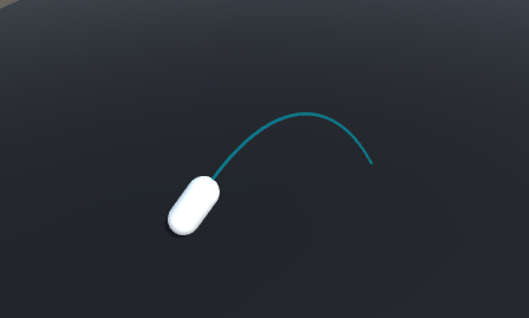
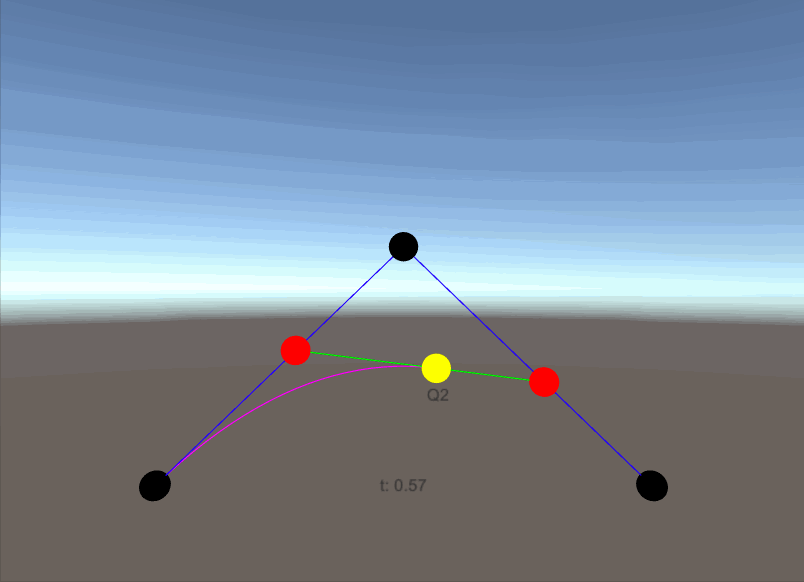
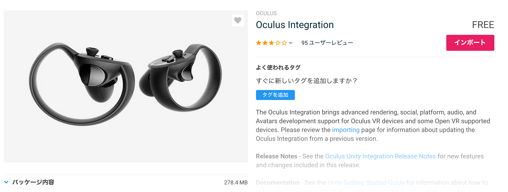
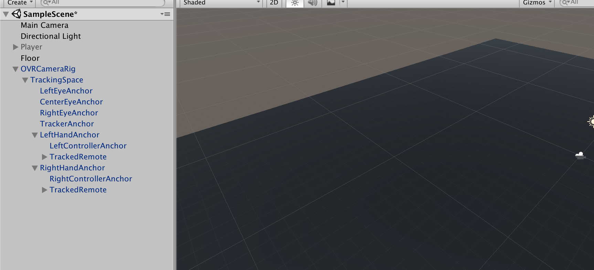
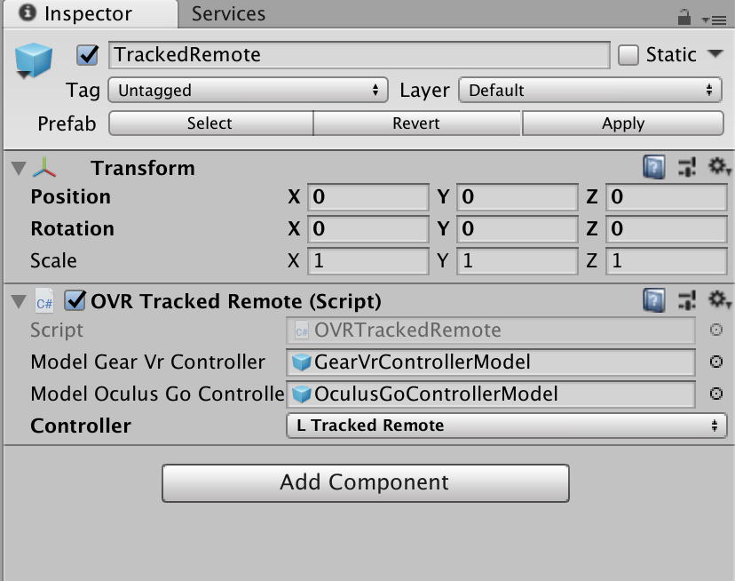
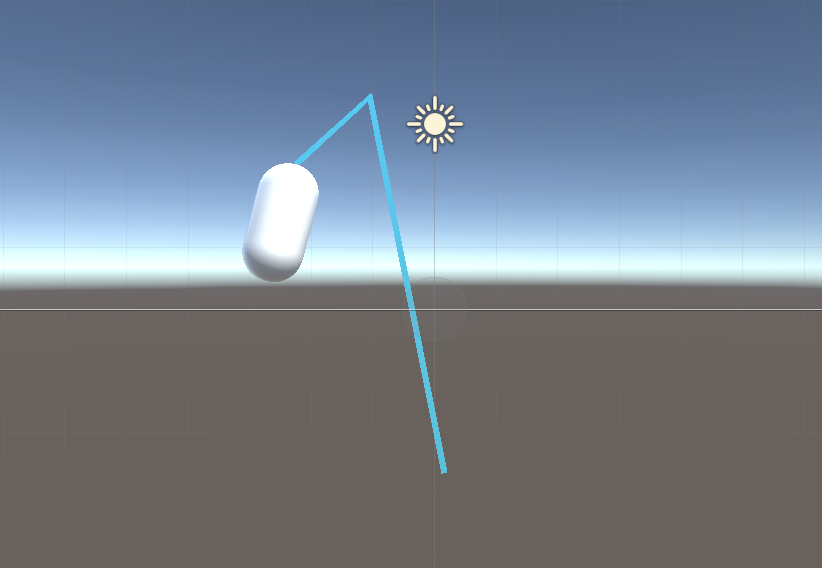
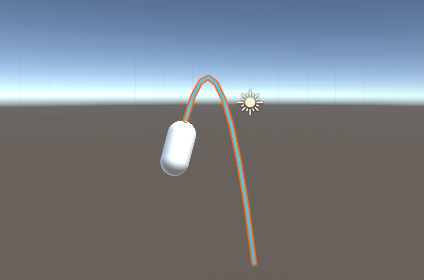
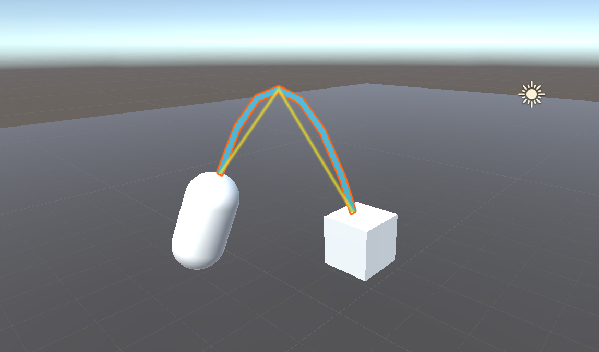

<!-- [Unity]ベジュ曲線のテレポート移動を一から作ってみる (1) for Oculus Go -->

# はじめに
VRアプリでよく見かけるコントローラーから放物線を描くレイを飛ばし、レイが床に当たったポイントに移動する移動方法があります。この**移動手段でよく使われているレイの放物線はベジュ曲線と呼ばれています。**Unityでベジュ曲線を使ったテレポートを一から実装してみようと思います。

**今回HMDはOculus Goを使います。また、Oculus GoアプリをUnityで開発できるようにするための設定周りは説明しません。**お持ちでない方は、適当な3Dオブジェクト(見た目的に、カプセルの形がおすすめ)を擬似的にコントローラーとすることで進めてください。

この記事では**ベジュ曲線の原理と共にレイを飛ばすところまでの実装方法を説明します。**



# ベジュー曲線とは

wikipediaの説明によると、

>ベジェ曲線（ベジェきょくせん、Bézier Curve）またはベジエ曲線とは、N 個の制御点から得られる N − 1 次曲線である

この説明ではさっぱりわからないですね。

簡単に言うと、**制御点と呼ばれるものから作られる滑らかな曲線のことです。**

ここでは2次元ベジュ曲線を利用するので、2次ベジュ曲線について説明します。



**2次ベジュ曲線を作るにはまず、制御点と呼ばれる点を3点用意します。**隣り合う制御点同士を繋いだ直線を引きます。制御点同士を繋いだ直線を時間とともに徐々に進む点を作ります。先ほど作った徐々に進む点同士を繋いだ直線を引きます。先ほど作った直線を時間とともに徐々に進む点を作ります。最後に作った点の軌跡が2次元ベジュ曲線になります。

さらに制御点を増やし、同じ手順で曲線を作ると、3次ベジュ曲線、4次ベジュ曲線
と高次のベジュ曲線を描くことができます。**高次になればなるほど、計算量は増えます。**

# プレイヤーの準備

まず、y座標0の位置に、適当に床を作成しておいて下さい。

Assetストアから、Oculus Integrationをインポートして下さい。



Projectの`Oculus → VR → Prefabs → OVRCameraRig`、`Oculus → VR → Prefabs → TrackedRemote`を使います。
`OVRCameraRig`をHierarchyに配置し、`OVRCameraRig`の子要素の`LeftHandAnchor`、`RightHandAnchor`に`TrackedRemote`をアタッチしてください。床より2mほどあげてあげるとちょうど良い高さになります。



アタッチした`TrackedRemote`の`Controller`の項目はInspectorから正しい方(Left or Right)の値にセットしてください。



これで、ビルドするとVR空間にコントローラーが動くだけのアプリができます。

# コントローラーの位置・傾きから制御点を算出する

Projectsで`teleportController.cs`を作成し、`TrackedRemote`にアタッチしてください。

**2次ベジュ曲線を作るためには、3点の制御点が必要です。**3点(2次ベジュ曲線の黒色の点)を開始点(`p0`)、経過点(`p1)`、終着点(`p2`)とします。

制御点を算出するために、2つのパラメーターを用意します。`distance`と`dropHeight`です。
`distance`は移動距離の補正に使用します。
`dropHeight`は開始点より終着点をどれだけ下げるか調整する値です。

**開始点は、(`コントローラーの位置`）になります。**
**経過点は、(`開始点`) + (`コントローラーの向き`) * (`distance/2`) になります。**
**終着点は、(`開始点`) + (`コントローラーの向き`) * (`distance`) で算出された点のYを(`開始点のY - dropHeight`)にした点になります。**

下のレイのようなイメージです。



これを、コードに落としこむと、

```cs
Vector3 p0 = pointer.transform.position;
Vector3 p1 = pointer.transform.position + pointer.transform.forward * distance/2;
Vector3 p2 = pointer.transform.position + pointer.transform.forward * distance;
p2.y = p0.y - dropHeight;
```

# 制御点から生まれる点を算出する

3点の制御点を作ったので、制御点同士を結んだ直線上を動く点(2次ベジュ曲線の赤色の点)を算出します。2点は`b01`、`b12`とします。

今回、本来表現すべきベジュ曲線の軌跡の何点かを取得し、直線で繋げることで擬似的にベジュ曲線に見せる形で再現します。
その分割点の数を`n`とします。

**`i`点目の`b01`は、(`p0 * (n-1-i) / (n-1)`) + (`p1 * (i / (n-1))`)になります。**
**`i`点目の`b12`は、(`p1 * (n-1-i) / (n-1)`) + (`p2 * (i / (n-1))`)になります。**

※_`i`は0から始まります。_

`b01`、`b12`ができたので、2点を結んだ直線上を動く点(2次ベジュ曲線の黄色の点)を算出します。その点は`b123`とします。
この点を直線で繋げることで、ベジュ曲線が完成します。

**`i`点目の`b123`は、(`b01 * (n-1-i) / (n-1)`) + (`b12 * (i / (n-1))`)になります。**

`b123`を直線で繋げた時のレイは下のようなイメージになります。



いい感じに、ベジュ曲線が描けてきました。

これを、コードに落とし込むと、

```cs
for(int i = 0; i < n; i++)
{
  float amp = ((float)i/(float)(n-1));
  Vector3 b01 = Vector3.Lerp(p0, p1, amp);
  Vector3 b12 = Vector3.Lerp(p1, p2, amp);

  Vector3 b012 = Vector3.Lerp(b01, b12, amp);
}
```

※_`Lerp`は知らなければ、各自調べてください。_

# ベジュ曲線を物体に衝突した段階で止める

このままでは、ベージュ曲線は物体と通過して表示されてしまいます。そのため、物体に衝突したかチェックし、衝突した段階で表示を止める必要があります。

**２点の`b123`を繋げた直線上に、衝突する物体があるかどうかをチェックさせることで、これを実現します。**

**2の位置情報を与えると、直線上に物体があるかどうかチェックしてくれる便利な関数がUnityには存在します。**

```cs
Physics.Linecast(point1, point2, out hit)
```

※_`hit`には衝突した`Collide`の情報が入ります。_

これを利用して、衝突した先の点を全て衝突した位置にします。

衝突した際のレイは下のようなイメージになります。



これをコードに落とし込むと、

```cs
Vector3 _b012 = p0;

for(int i = 0; i < n; i++)
{
	float amp = ((float)i/(float)(n-1));
	Vector3 b01 = Vector3.Lerp(p0, p1, amp);
	Vector3 b12 = Vector3.Lerp(p1, p2, amp);

	Vector3 b012 = Vector3.Lerp(b01, b12, amp);

	RaycastHit hit;
	if(Physics.Linecast(_b012, b012, out hit))
	{
		Vector3 hitPoint = hit.point;
		for(int i2 = i; i2 < n; i2++) {
			Debug.Log("plot hitPoint");
	  }
		break;
	}
	else
	{
		Debug.Log("plot b012");
    _b012 = b012;
	}
}
```

# LineRendererを利用してコードを完成させる

`InitLine()`で`LineRenderer`コンポーネントをアタッチした`GameObject`を作成します。
`Draw()`で、これまで説明してきた内容を実行し、線を描いています。

※_`LineRenderer`の使い方は各自調べてください。_

```cs
using System.Collections;
using System.Collections.Generic;
using UnityEngine;
using UnityEngine.Rendering;

public class TeleportController : MonoBehaviour {

	// [SerializeField]
	GameObject pointer;

	[SerializeField]
	Material material;

	[SerializeField]
	float distance = 10;

	[SerializeField]
	float dropHeight = 5;

	[SerializeField]
	int positionCount = 10;

	[SerializeField]
	float width = 0.1f;

	GameObject line;
	LineRenderer lRend;

	void Start()
	{
		pointer = this.gameObject;
		InitLine();
	}
	
	void Update()
	{
		Draw();
	}

	void InitLine()
	{
		line = new GameObject("Line");
		line.transform.parent = pointer.transform;

		lRend = line.AddComponent<LineRenderer>();
		lRend.receiveShadows = false;
		lRend.shadowCastingMode = ShadowCastingMode.Off;
		lRend.loop = false;
		lRend.positionCount = positionCount;
		lRend.startWidth = width;
		lRend.endWidth = width;

		lRend.material = material;
	}

	void Draw()
	{
		Vector3 p0 = pointer.transform.position;
		Vector3 p1 = pointer.transform.position + pointer.transform.forward * distance/2;
		Vector3 p2 = pointer.transform.position + pointer.transform.forward * distance;
		p2.y = p0.y - dropHeight;

		Vector3 _b012 = p0;

		for(int i = 0; i < positionCount; i++)
		{
			float amp = ((float)i/(float)(positionCount-1));
			Vector3 b01 = Vector3.Lerp(p0, p1, amp);
			Vector3 b12 = Vector3.Lerp(p1, p2, amp);

			Vector3 b012 = Vector3.Lerp(b01, b12, amp);

			RaycastHit hit;
			if(Physics.Linecast(_b012, b012, out hit))
			{
				Debug.Log("hit!!");
				Vector3 hitPoint = hit.point;
				for(int i2 = i; i2 < positionCount; i2++) {
					lRend.SetPosition(i2, hitPoint);
				}
				break;
			}
			else
			{
				lRend.SetPosition(i, b012);
				_b012 = b012;
			}
		}
	}
}
```

# Oculus Goのコントローラーでレイの制御をできるようにする

**ここから先は、Oculus Go固有の対応なので、持ってない方は読む必要はありませんん。**

現状だと、`LeftHandAnchor`、`RightHandAnchor`の`TrackedRemote`両方からレイが出てしまうので、どちら側(L or R)でコントローラーを持っているか判定し、持っている方の`TrackedRemote`のみレイを表示させるようにします。

まずは、使用するOculus IntegrationのAPIを説明します。

`OVRInput.Controller`型でどちらが側(L or R)のコントローラーか設定させます。`OVRInput.IsControllerConnected(mController)`コントローラーがアクティブかどうかチェックできます。

```cs
OVRInput.Controller mController;
bool controllerConnected = OVRInput.IsControllerConnected(mController);
```

`OVRInput.GetDown([ボタン])`でボタンが押された時の検知を、`OVRInput.GetUp([ボタン])`でボタンを離した時の検知を拾えます。

ボタンの部分はたくさんあるので、[OVRInput(公式サイト)](https://developer.oculus.com/documentation/unity/latest/concepts/unity-ovrinput/)をみてください。

ここではトリガーを使うので、`OVRInput.Button.PrimaryIndexTrigger`です。

```cs
if(OVRInput.GetDown(OVRInput.Button.PrimaryIndexTrigger))
{
  Debug.Log("Down Trigger");
}

if(OVRInput.GetUp(OVRInput.Button.PrimaryIndexTrigger))
{
  Debug.Log("Up Trigger");
}
```

今説明したAPIを利用して、コントローラーがアクティブかつトリガーが引かれている時のみレイを飛ばすようにします。

`activeDraw`を用意することで、無駄にベジュ曲線の計算をさせることを防いでいます。
トリガーを押したとき、離したときそれぞれ別の関数を呼び、関数のなかでレイのアクティブ化、`activeDraw`の切り替えをさせています。

```cs
[SerializeField]
OVRInput.Controller mController;

bool activeDraw = false;

...

void Update()
{
  bool controllerConnected = OVRInput.IsControllerConnected(mController);

	if(!controllerConnected)
	{
		return;
	}
	else
	{
		if(OVRInput.GetDown(OVRInput.Button.PrimaryIndexTrigger))
		{
			OnTriggerDown();
		}

		if(OVRInput.GetUp(OVRInput.Button.PrimaryIndexTrigger))
		{
			OnTriggerUp();
		}

		if(activeDraw)
		{
			Draw();
		}
	}
}

void OnTriggerDown()
{
	activeDraw = true;
	line.SetActive(true);
}

void OnTriggerUp()
{
	activeDraw = false;
	line.SetActive(false);
}
```

トリガーを引けばレイが出るようになりました。


# さいごに
次は、テレポートできるエリアの設定とトリガーを離したときテレポートできるようにします。
