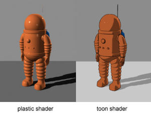
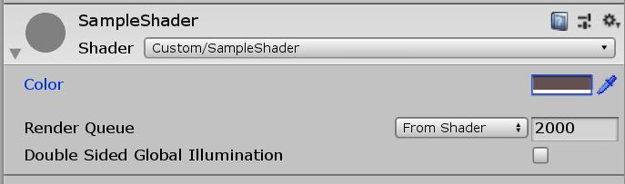
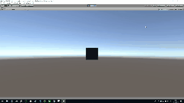

<!-- [Unity] スクリプトで始めるUnity Shaderの基礎2019 (1) -->

# はじめに
この記事では、Shaderはどのようなものなのか、そしてどのようにShaderを作っていくのかという超入門的なところを説明しています。

※_Shaderを勉強し始めたばかりのため、説明が間違ってる箇所、説明があいまいな個所があると思いますがご了承下さい。間違っている箇所あればコメントにて指摘してください。_

# Shaderとは

**Shaderは3Dオブジェクトの見え方をカスタマイズできるものです。**
Shaderを使えば、3Dオブジェクトをアニメ調(Toon Shader)にしたり、内部から光が漏れているような表現をさせたりできます。



Unityのシェーダーは大きく2つに書き方が分かれます。

・**Surface Shader**
・**Vertex/Fragment Shader**

**Surface ShaderはVertex/Fragment Shaderを簡単に扱えるように包んだものみたいなイメージです。**なので基礎を学ぶのであれば、Vertex/Fragment Shaderを学ぶのがいいと思います。**この記事ではVertex/Fragment Shaderでスクリプトを書いていきます。**

# Shader言語について

**Unityでは、Cg言語とShaderLabを駆使してShaderを書きます。**

### Cg言語

Cg言語は、GPUを利用してCG描写させるためのShader言語です。Unityでは使われていませんが、Cg言語以外にも有名なShader言語(HLSL、GLSL、DirectX)があります。

### ShaderLab

ShaderLabはUnity独自の言語で、UnityでShaderを書くのに便利な関数や仕組みが容易されています。

### Shaderスクリプトの例

CGPROGRAM ～ ENDCGで囲われている箇所は、Cg言語で書かれています。Propertiesや、TagsはShaderLabです。

```js
Shader "Custom/SampleShader"
{
  Properties
  {
    _Color ("Color", Color) = (1,1,1,1)
  }
  SubShader
  {
    Tags { "RenderType"="Opaque" }
    LOD 200

    Pass
    {
      CGPROGRAM

      #pragma vertex vert
      #pragma fragment frag

      #include "UnityCG.cginc"

      struct appdata
      {
        float4 vertex : POSITION;
      };

      struct v2f
      {
        float4 vertex : SV_POSITION;
      };

      fixed4 _Color;

      v2f vert(appdata v)
      {
        v2f o;
        o.vertex = UnityObjectToClipPos(v.vertex);
        return o;
      }

      fixed4 frag(v2f i) : SV_TARGET
      {
        return _Color;
      }

      ENDCG
    }
  }
}
```

# CG描写の流れについて(レンダリングパイプライン)

**CG描写の流れのことをレンダリングパイプラインといいます。**ざっくりイメージとしては、3D空間に配置したオブジェクトの頂点情報から3D空間にモデルを作り出し、カメラを通してモデルが2D画面のどの位置に映るかを算出し、映る場所に色を塗るというような流れになっています。

**Vertex/Fragment Shaderでは、基本的に3D空間の頂点の操作、頂点データから作られる画素(面)に色を塗ることができます。**

CGPROGRAM内で`#pragma vertex vert`を宣言し頂点の操作を、`#pragma fragment frag`を宣言し画素に色を塗れるようになります。

# ハンズオン

### 準備

まず、ShaderとMaterialを作成しましょう。

**Poject内で右クリック→Create→Shader**から適当に選んでShaderを作成しましょう。作成できたら**Shaderを右クリック→Create→Material**でマテリアルを作成しましょう。

BoxオブジェクトにMaterialを適用しましょう。

適当にBoxオブジェクトを作成し、Materialをアタッチしてください。

### Shader

それでは実際に、Shaderを書いていきます。

※_Shaderはすでに何か書かれていますが消してしまってください。_

```js
Shader "Custom/SampleShader" // Shader "グループ名/Shader名"
{
  SubShader
  {
    Tags { "RenderType"="Opaque" } // Shaderの分類を定義します
    LOD 200

    Pass 
    {
      CGPROGRAM

      // Cg言語をここに書きます。

      ENDCG
    }
  }
}
```

Cg言語を書いていきます。
まずは、**Vertex/Fragment Shader**を使用するための宣言、Unityの便利な関数が詰まった**UnityCG.cginc**を読み込みます。

```js
Pass 
{
  CGPROGRAM

  #pragma vertex vert // 頂点の操作
  #pragma fragment frag // 画素の色塗り

  #include "UnityCG.cginc"
  
  ENDCG
}
```

`vert`関数と`frag`関数使用する頂点情報の構造体を作ります。
頂点情報として、座標を使用するので`float4`型で`vertex`を定義しています。

`POSITION`や`SV_POSITION`はセマンティクスといい、変数がどのような役割を持っているのかを示しています。セマンティックスのおかげでレンダリングパイプラインがうまく変数を識別できています。

```js
Pass 
{
  CGPROGRAM

  #pragma vertex vert
  #pragma fragment frag

  #include "UnityCG.cginc"
  
  // vert関数で使用する構造体
  struct appdata
  {
    float4 vertex : POSITION;
  };

  // vert関数、frag関数で使用する構造体
  struct v2f
  {
    float4 vertex : SV_POSITION;
  };

  ENDCG
}
```

頂点情報のつまった構造体ができたので、頂点を操作する`vert`関数を書いていきます。

ここでの`vert`関数は`appdata`型から`v2f`型に変換しているだけです。

`UnityObjectToClipPos`は`UnityCG.cginc`が用意してくれている便利な関数です。3D空間の座標情報を2D画面の画像情報に変換してくれます。

```js
Pass 
{
  ...

  struct appdata
  {
    float4 vertex : POSITION;
  };

  struct v2f
  {
    float4 vertex : SV_POSITION;
  };

  // 頂点の操作をする関数
  v2f vert(appdata v)
  {
    v2f o;
    o.vertex = UnityObjectToClipPos(v.vertex);
    return o;
  }

  ENDCG
}
```

`vert`関数ができたので、画素に色を塗る`frag`関数を書いていきます。

`frag`関数では`fixed4`型で塗る色のrgbaを返しているだけです。`fixed4(0.5, 0.5, 0.5, 1)`なのでグレーになります。

```js
Pass 
{
  ...

  struct appdata
  {
    float4 vertex : POSITION;
  };

  struct v2f
  {
    float4 vertex : SV_POSITION;
  };

  v2f vert(appdata v)
  {
    v2f o;
    o.vertex = UnityObjectToClipPos(v.vertex);
    return o;
  }

  // 画素に色を塗る関数
  fixed4 frag(v2f i) : SV_TARGET
  {
    return fixed4(0.5, 0.5, 0.5, 1);
  }

  ENDCG
}
```

ただグレーに塗るだけでは寂しいにで、インスペクターから色を変更できるようにします。

これを実現するのはShaderLabです。`Properties`を利用して、インスペクター上で色を選択できるようにします。

変数は`変数名("インスペクター上の表記", 変数の型) = 初期値`で定義します。

```js
Shader "Custom/SampleShader"
{
  // インスペクターで変数を変えられるようになる
  Properties
  {
    _Color ("Color", Color) = (1,1,1,1)
  }

  ...

}
```

Colorの項目がインスペクター上で確認できるはずです。



次に、`_Color`の変数で画素を塗るように`CGPROGRAM`の中を修正します。

これで、インスペクター上で色を変えられるShaderができたはずです。

```js
Pass 
{
  ...

  struct appdata
  {
    float4 vertex : POSITION;
  };

  struct v2f
  {
    float4 vertex : SV_POSITION;
  };

  // Propertiesで定義した変数をCGPROGRAM内で定義する
  fixed _Color;

  v2f vert(appdata v)
  {
    v2f o;
    o.vertex = UnityObjectToClipPos(v.vertex);
    return o;
  }

  fixed4 frag(v2f i) : SV_TARGET
  {
    return _Color; // 定義した_Colorを返すように書き換える
  }

  ENDCG
}
```

最後に、時間とともに頂点を動かして拡大・縮小させてみます。

`UnityCG.cginc`が時間も`_Time`として用意してくれているので、こちらをsinカーブの引数として利用して拡大・縮小させます。


```js
Pass 
{
  ...

  v2f vert(appdata v)
  {
    v2f o;
    float amp = 0.5 * sin(_Time * 100); // 拡大率を決める
    o.vertex = UnityObjectToClipPos(v.vertex * amp); // 拡大率を座標にかける
    return o;
  }

  ...
}
```



# 最後に
Shaderがどのようなものか、そしてどのように作っていくのか見えてきましたか？
次回は、**頂点座標(POSITION)だけでなく、UV座標など他の変数も使いShaderをより深く理解できる記事を書きます。**