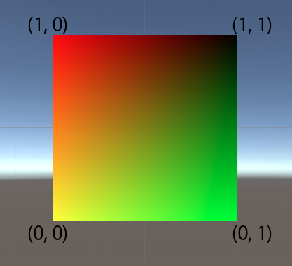
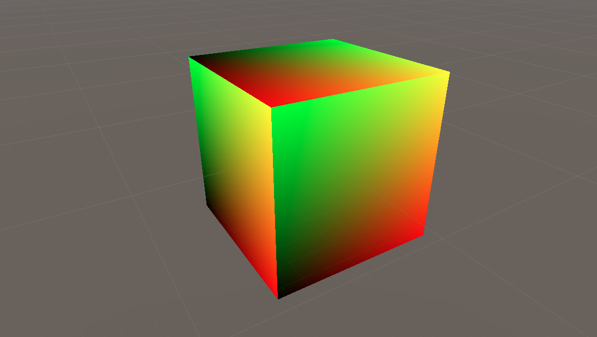
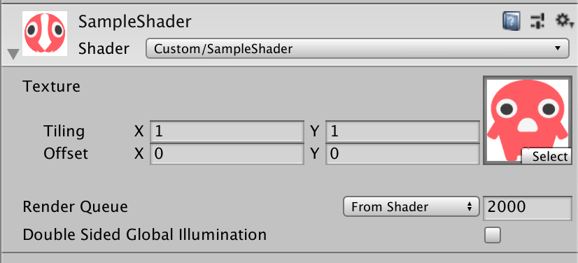
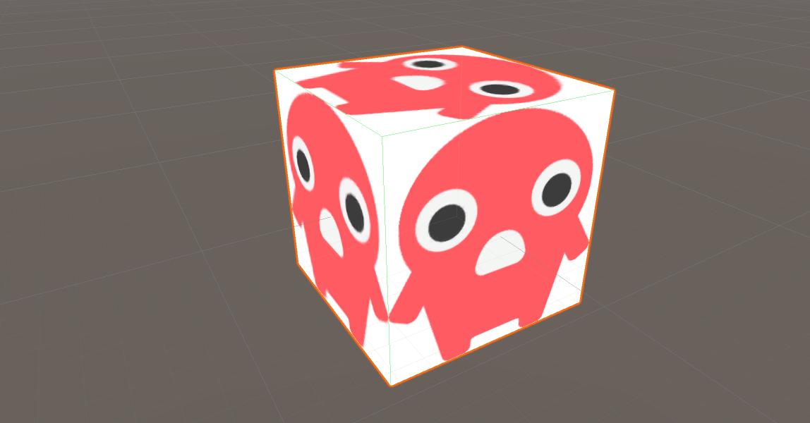
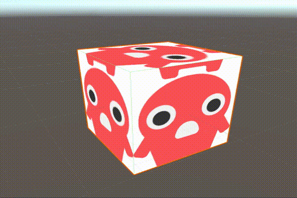
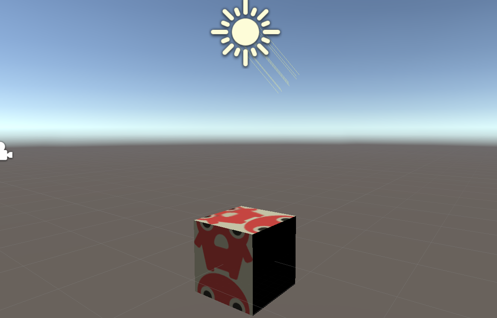

<!-- [Unity] スクリプトで始めるUnity Shaderの基礎2019 (2) -->

# はじめに

この記事では、前回扱わなかったUV座標と法線ベクトルを使ったShaderの作り方を説明しています。

※_Shaderを勉強し始めたばかりのため、説明が間違ってる箇所、説明があいまいな個所があると思いますがご了承下さい。間違っている箇所あればコメントにて指摘してください。_

### シリーズ

[【Unity】スクリプトで始めるUnity Shaderの基礎2019 (1)](https://qiita.com/kousaku-maron/items/d686ad7b40ec3ae839c2)

# UV座標とは

**UV座標は、3Dオブジェクトの表面の座標です。**3Dオブジェクトの頂点座標とは違うとこに注意してください。3Dオブジェクトの表面の左下を(0, 0)、右上を(1, 1)となるようにUV座標は設定されます。



# UV座標で色を変化させてみる

まず、Shaderファイルを準備します。
下記のスクリプトは前回の記事を見ればわかると思うので説明しません。

```shader
Shader "Custom/SampleShader"
{
  SubShader
  {
    Tags { "RenderType"="Opaque" }
    LOD 200

    Pass
    {
      CGPROGRAM

      #pragma vertex vert
      #pragma fragment frag

      #include "UnityCG.cginc"

      struct appdata
      {
        float4 vertex : POSITION;

      };

      struct v2f
      {
        float4 vertex : SV_POSITION;
      };

      v2f vert(appdata v)
      {
        v2f o;
        o.vertex = UnityObjectToClipPos(v.vertex);
        return o;
      }

      fixed4 frag(v2f i) : SV_TARGET
      {
        return fixed4(1, 1, 1, 1);
      }

      ENDCG
    }
  }
}
```

UV座標を扱えるようにするため、`appdata`、`v2f`の構造体に`float2`型の`uv`を追加します。`uv`には`TEXCOORD0`のセマンティクスをつけて、GPUがuv座標であることを認識できるようにします。

```shader
struct appdata
{
  float4 vertex : POSITION;
  float2 uv : TEXCOORD0;
};

struct v2f
{
  float4 vertex : SV_POSITION;
  float2 uv : TEXCOORD0;
};
```

`uv`情報を構造体に含ませることができたので、頂点を操作する`vert`関数で`uv`情報を次へ渡すように書き加えます。

`vert`関数は`o`の`uv`に代入しているだけです。

```shader
v2f vert(appdata v)
{
  v2f o;
  o.vertex = UnityObjectToClipPos(v.vertex);
  o.uv = v.uv; // uv代入
  return o;
}
```

`vert`関数でuv情報を受け渡す処理は書けたので、画素に色を塗る`frag`関数でuv情報を元に色を塗るように修正していきます。

`frag`関数では`fixed4`型で塗る色のrgbaを返すので、uv情報をrgbaのどこかのパラメーターに加えてしまえば良いです。

※_このShaderは半透明設定をしていないので、`a`にuv情報を加えても変化がありません。_

```shader
fixed4 frag(v2f i) : SV_TARGET
{
  return fixed4(i.uv.x, i.uv.y, 0, 1); //uvを使って色を決める
}
```

綺麗なグラデーションが見れれば、成功です。



# UV座標でテキスチャを貼ってみる

uv座標がどのようなものか理解できたと思うので、次はuv座標を使って3Dオブジェクトにテキスチャ(画像)を貼ってみましょう。

**仕組みとしては、テキスチャ(画像)とuv座標から色を取得して画素を塗ります。**

uv座標の受け渡しは、先ほどのスクリプトと変わらないので説明は省きます。

まずは、インスペクターからテキスチャ(画像)を選択できるようにします。

インスペクターから値をセットできるようにするには`Properties`を使えば良いと前回説明しました。テキスチャ(画像)は`2D`型なので、`2D`型で`_MainTex`を作成しましょう。

※_初期値の `"White" {}` は、テキスチャが選択されていない時白色で表示するという設定になります。_

```shader
Properties
{
  _MainTex ("Texture", 2D) = "White" {}
}
```

これで、インスペクターからテキスチャ(画像)を選択できるようになっているはずです。

※_下の画像は、既にテキスチャ(画像)を選択済みです。_



次に、テキスチャ(画像)から色を取得し、画素を塗るように`CGPROGRAM`の中を修正します。

`2D`型はCg言語では`sampler2D`型になります。

`UnityCG.cginc`がテキスチャ(画像)とuv座標から色を取得する関数を`tex2D`として用意してくれているので、こちらを利用して画素を塗る色を取得します。

```
struct v2f
{
  float4 vertex : SV_POSITION;
  float2 uv : TEXCOORD0;
};

// Propertiesで定義した変数をCGPROGRAM内で定義する
sampler2D _MainTex;

v2f vert(appdata v)
{
  v2f o;
  o.vertex = UnityObjectToClipPos(v.vertex);
  o.uv = v.uv;
  return o;
}

fixed4 frag(v2f i) : SV_TARGET
{
  fixed4 color = tex2D(_MainTex, i.uv); // テキスチャから色取得
  return color;
}
```

これで、ボックス6面にテキスチャ(画像)が貼れているはずです。



最後に、uv座標を時間とともに変化させて、表示しているテキスチャ(画像)を動かしてみます。

前回の記事でも出てきた`_Time`を利用します。
時間とともに、uv座標の`y`を増加させています。

※_モードにもよるのですが、uv座標が1を超える場合、`tex2D`関数はuv座標の小数点部分のみをuv座標として取り込みます。イメージとしては、画像が縦にも横にも無限に配置されていてuv座標が(2,2)の場合、イメージです。_

```
v2f vert(appdata v)
{
  v2f o;
  o.vertex = UnityObjectToClipPos(v.vertex);
  o.uv = v.uv;
  o.uv.y += _Time * 10;
  return o;
}
```

テキスチャ(画像)が下に流れます。



次は、法線ベクトルについて説明します。

# 法線ベクトルとは

**法線ベクトルは、面に対して垂直なベクトルです。**法線ベクトルと光のベクトルを組み合わせて計算することで、面が受ける光の影響を計算することができます。

法線ベクトルと光のベクトルが平行であればあるほど面は光の影響を受け、垂直であればあるほど光の影響を受けません。


# 光の影響を受けるようにする

法線ベクトルを扱えるようにするため、`appdata`の構造体に`float3`型の`normal`を追加します。`v2f`の構造体には`float3`型の`worldNormal`を追加します。`nomal`には`NORMAL`のセマンティクス、`worldNormal`には`TEXCOORD1`のセマンティクスをつけて、GPUが法線ベクトルであることを認識できるようにします。

```shader
struct appdata
{
  float4 vertex : POSITION;
  float2 uv : TEXCOORD0;
  float3 normal :NORMAL;
};

struct v2f
{
  float4 vertex : SV_POSITION;
  float2 uv : TEXCOORD0;
  float3 worldNormal : TEXCOORD1;
};
```

法線ベクトルを構造体に含ませることができたので、頂点を操作する`vert`関数で法線ベクトルを次へ渡すように書き加えます。

`vert`関数は`o`の`normal`を`worldNomal`に変換しているだけです。

`UnityObjectToWorldNomal`は`UnityCG.cginc`が用意してくれている便利な関数です。ローカル座標でのベクトルをワールド座標でのベクトルに変換してくれます。

```
v2f vert(appdata v)
{
  v2f o;
  o.vertex = UnityObjectToClipPos(v.vertex);
  o.uv = v.uv;
  o.uv.y += (_Time * 10);
  o.worldNormal = UnityObjectToWorldNormal(v.normal);
  return o;
}
```

次に、ディレクションライトをShaderで扱えるようにするための設定をします。

必要な変数を使えるようにするため、`Lighting.cginc`を読み込みます。
`Tags`に`"LightMode"="ForwardBase"`を追加し、ライトモードを変更します。

```
Tags {
  "RenderType"="Opaque"
  "LightMode"="ForwardBase" // ライトモードを変更
}
LOD 200

Pass
{
  CGPROGRAM
  
  #pragma vertex vert
  #pragma fragment frag
  
  #include "UnityCG.cginc"
  #include "Lighting.cginc" //　モジュールを読み込む

  ...
}
```

`Lighting.cginc`を読み込むことで、ディレクションライトの向きベクトルである`_WorldSpaceLightPos0.xyz`、ディレクションライトの色である `_LightColor0`を使えるようになります。

**光のベクトルと法線ベクトルが垂直かどうかは内積を利用して測ります。**
下記の式からわかるように、内積の値は垂直(90度)であればあるほど0に近くなります。

※_三角関数、内積がわからないかたはそういうものなのだと思ってください。_

```math
\vec{a}*\vec{b} = |\vec{a}|*|\vec{b}|cosθ
```

内積を利用し、画素を塗る色を算出していきます。

```shader
fixed4 frag(v2f i) : SV_TARGET
{
  float3 lightDir = _WorldSpaceLightPos0.xyz; // ライトの向き
  float3 normal = normalize(i.worldNormal); // ライトの向きを正規化
  float nl = dot(normal, lightDir); // ライトの向きと法線ベクトルの内積
  
  float3 lightColor = _LightColor0; // ライトの色
  fixed4 color = tex2D(_MainTex, i.uv);
  
  return fixed4((color * lightColor * max(nl, 0)), 0); // ライトの色とテキスチャを融合
}
```

ライトが当たっているところは見えるオブジェクトができているはずです。



# さいごに

UV座標、法線ベクトルがどのなものかわかったでしょうか。またこれを利用することでテキスチャが貼れたり、光の影響を受けさせたりできることがわかったと思います。

次回は、また何か思いついたら書きます。